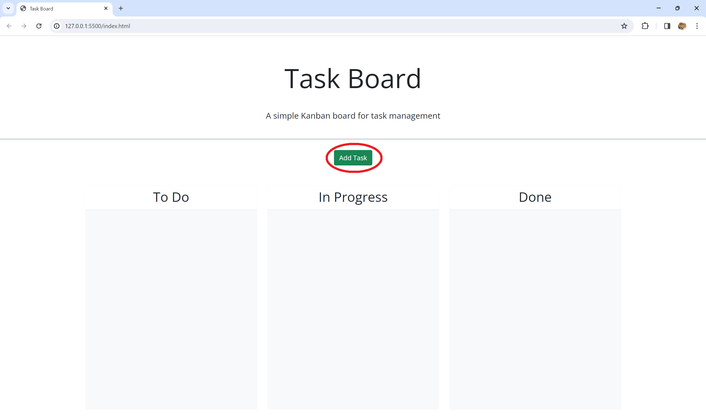
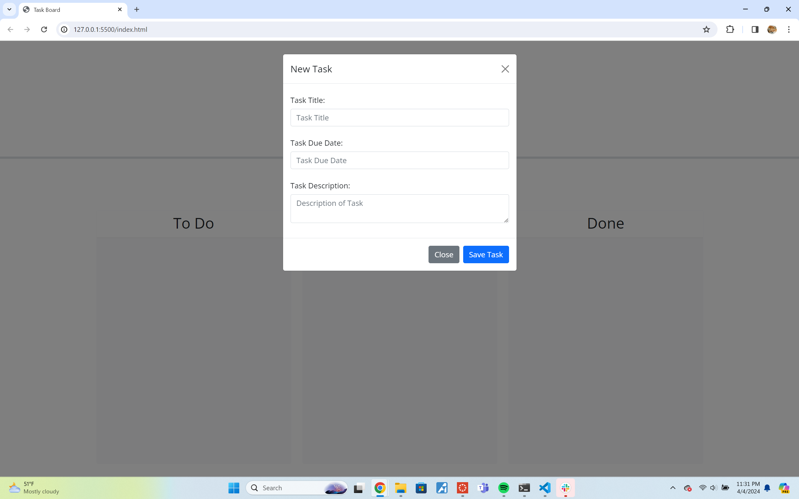
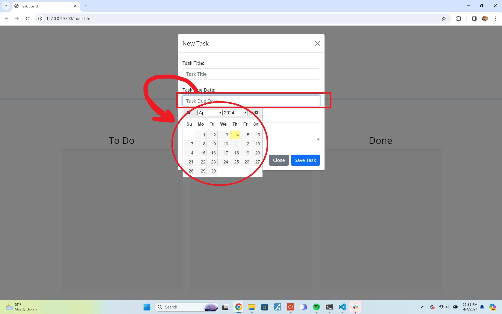

# Task-Board-Mng

## Description

This was meant to be a way to get used to jQuery, dayjs, and bootstrap components. Most of the work was done in script.js, to which I mostly stumbled. I got nothing working, but I will get help later.

## Table of Contents

- [Installation](#installation)
- [Usage](#usage)
- [Credits](#credits)
- [License](#license)

## Installation

It's a webpage; Nothing more than this: 

## Usage

The site is blank at first, and pressing the 'Add Task' button takes you to a modal.

This is the modal.

The 'due date' field has a datepicker attached.

There would be more if it worked, but currently the JavaScript is at a stalemate with itself. Apologies.

## Credits

Helped figure out what I could use to generate an id:
https://stackoverflow.com/questions/26203453/jquery-generate-unique-ids

Most code used was from the mini project from Third-Party-APIs.

## License

MIT License

Copyright (c) 2024 Paula 'Fel' Gonzalez

Permission is hereby granted, free of charge, to any person obtaining a copy
of this software and associated documentation files (the "Software"), to deal
in the Software without restriction, including without limitation the rights
to use, copy, modify, merge, publish, distribute, sublicense, and/or sell
copies of the Software, and to permit persons to whom the Software is
furnished to do so, subject to the following conditions:

The above copyright notice and this permission notice shall be included in all
copies or substantial portions of the Software.

THE SOFTWARE IS PROVIDED "AS IS", WITHOUT WARRANTY OF ANY KIND, EXPRESS OR
IMPLIED, INCLUDING BUT NOT LIMITED TO THE WARRANTIES OF MERCHANTABILITY,
FITNESS FOR A PARTICULAR PURPOSE AND NONINFRINGEMENT. IN NO EVENT SHALL THE
AUTHORS OR COPYRIGHT HOLDERS BE LIABLE FOR ANY CLAIM, DAMAGES OR OTHER
LIABILITY, WHETHER IN AN ACTION OF CONTRACT, TORT OR OTHERWISE, ARISING FROM,
OUT OF OR IN CONNECTION WITH THE SOFTWARE OR THE USE OR OTHER DEALINGS IN THE
SOFTWARE.
